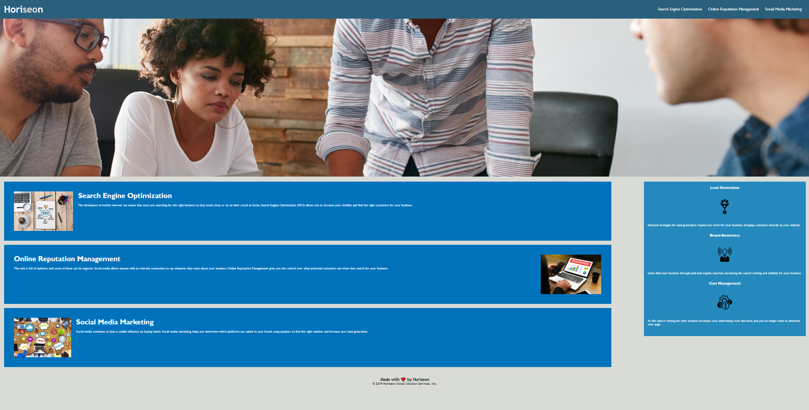

# Code Refactor Starter Code

## DESCRIPTION
### In line with the assignment outline, the code has been refactored to follow accessibility standards. 
### The following acceptance criteria have also been addressed:
*  Semantic HTML elements have been incorporated;
*  elements follow a clear and logical structure;
*  description attributes have been added to all images;
*  heading attributes are sequential; and
*  the re-named title is descriptive and concise.  

## SCREENSHOT

## LINK TO DEPLOYED APPLICATION

